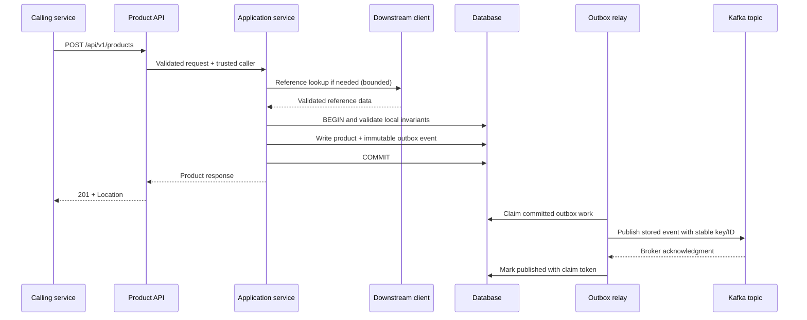

# End-to-End Reference Flow

## Create a product with downstream validation and a Kafka event

This sequence illustrates the required ownership and failure behavior. It is architectural pseudocode, not a runnable sample application.



The optional downstream lookup is for information that does not require remote mutation. If the operation needs a reservation or payment, use a persisted workflow with its own status, idempotent steps, and compensation; a read-before-write check is insufficient.

Pseudocode showing transaction separation:

```text
ProductFacade.create(request, caller):                 // no DB transaction
    authorize caller and validate request
    replay completed idempotent outcome if present, after identity/hash validation
    reference = catalogClient.lookupIfRequired(request) // deadline/retry policy
    return productWriter.create(request, reference, caller) // separate Spring bean

ProductWriter.create(...):                            // @Transactional on proxy
    validate local business and tenant rules
    recheck/claim durable idempotency record atomically if required by operation
    insert product with server-owned identity and timestamps
    allocate aggregate event sequence
    construct and serialize ProductCreated event
    insert outbox row in SAME transaction
    persist replayable result if idempotency is required
    return mapped ProductResponse                     // proxy commits before facade returns
```

For read: execute an authorized bounded projection in a read-only transaction, map to a DTO, then return 200 or 404. Do not publish change events for reads.

For update: load the authorized entity, compare the supplied expected version, validate the transition, mutate allowed fields, increment the explicit business event sequence, and insert `ProductUpdated` in the same transaction. Flush when needed to obtain version values for the response, but still wait for commit before HTTP success. An optimistic conflict rolls back both state and event.

For delete: validate deletion rules, capture the minimal deletion-event data, delete/soft-delete the entity, and insert `ProductDeleted` in the same transaction. Keep the outbox independent of a cascading foreign key to a product row that may be deleted. Return 204 only after commit.

## Failure expectations

| Failure point | Required outcome |
| --- | --- |
| Input/authentication/authorization failure | No business write; safe 4xx |
| Required downstream lookup fails | No local write; translated error |
| Unique/optimistic conflict | DB and outbox roll back; 409 under body-version contract |
| Event serialization or outbox insert fails | Business write rolls back; safe error |
| DB commits but HTTP response is lost | Caller retry uses durable idempotency when required |
| Kafka unavailable after DB commit | HTTP success remains valid; event stays pending and retries |
| Relay crashes before sending | Claim expires; another worker recovers |
| Relay crashes after send acknowledgment | Event may be duplicated; same ID permits deduplication |
| Consumer DB commits but offset does not | Redelivery; deduplication prevents repeated DB effect |
| Retry policy exhausted | Durable quarantine/DLT, alert, controlled recovery |

Do not respond with 500 solely because a subsequent asynchronous publication attempt failed after returning committed success. Report event-delivery incidents through operations/status mechanisms defined by the contract. Do not claim this flow provides a global DB/HTTP/Kafka transaction.
