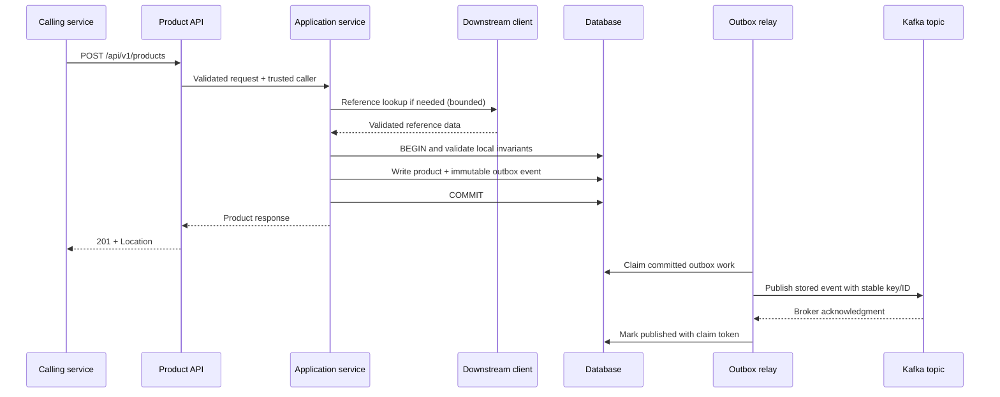

# Java Service Coding Standard

Version: 1.0

Date: 2026-09-09

Scope: Java REST services exposing service-to-service endpoints, performing relational database CRUD, calling downstream services, and publishing Kafka events.

This standard adapts the structure and engineering intent of `/Users/rage6c/Documents/docs/rest-api-coding-standard/`. The source is C#/.NET; this is a Java-specific standard, not a literal API-name translation. Spring and Kafka mechanics were checked against official documentation linked in the relevant topics.

## Baseline and rule strength

The default architecture is Spring Boot with Spring MVC, Spring Data JPA/Hibernate, Bean Validation, a managed synchronous REST client, and Spring for Apache Kafka. Examples use Java 21 language features or earlier. Each implementing repository MUST pin an organization-supported JDK, Spring Boot release/BOM, database driver, Kafka-compatible client, and build tool. This standard does not assert a latest patch version or prescribe a runtime upgrade.

MUST/MUST NOT are required. SHOULD is the default unless a documented technical reason justifies another choice. MAY is optional. Architecture choices such as reactive persistence, non-relational storage, or a durable alternative to the outbox require a recorded decision preserving the stated guarantees. Topic files and the consolidated document express the same standard; edit the topic files and regenerate the consolidated copy together.

Code blocks are focused excerpts or explicitly labeled pseudocode. Imports and supporting types may be omitted. They are not a compiled reference service or a complete security/deployment configuration.

## Core decisions

- Thin controllers; application services own business rules and transactions.
- Separate API DTOs, persistence entities, downstream DTOs, and event payloads.
- Typed configuration validated at startup; constructor injection and stateless singleton services.
- Database constraints, migrations, bounded queries, and optimistic concurrency.
- Configured downstream clients with deadlines, deliberate retries, and service identity.
- One local transaction for DB change plus outbox event; asynchronous at-least-once Kafka delivery with stable event IDs.
- Explicit API/event contracts, centralized problem responses, tracing, operational recovery, and meaningful integration tests.

## Deliberate adaptations from the reference

| Reference approach | Java standard decision |
| --- | --- |
| EF Core Fluent API with annotation-free entities | Explicit JPA mapping annotations on persistence-only entities; named schema/table and migrations retained |
| `AsNoTracking` and SQL-translated LINQ | Read-only transactions/projections and database-side repository queries; Java Streams are not a SQL query provider |
| Request-scoped business services | Stateless Spring singleton beans with transaction-bound persistence contexts |
| `Task` and `CancellationToken` throughout | Consistent blocking MVC/JPA by default, bounded I/O and explicit cancellation limits |
| Serilog console and rolling files | SLF4J/Logback; retain rolling-file policy with a documented stdout-only container option |
| xUnit/Moq and NuGet | JUnit Jupiter/Mockito, real-engine integration tests, Maven/Gradle and JVM dependency scans |
| Conflicting internal/unversioned API rules | Explicit stable URL major version for independently deployed callers |
| No new access-control middleware | Explicit service authentication/authorization boundary for the requested exposed endpoints |
| No dedicated Kafka consistency chapter | Durable outbox, producer acknowledgments, duplicate handling, ordering, quarantine and replay |

The reference's 80% overall and 90% new/changed line coverage thresholds are retained. Numerical timeout, size, and retention defaults in this standard are engineering starting values; validate them against the service contract and deployment capacity.

## Topic index

| Topic | File |
| --- | --- |
| Project Structure and Naming | [01-project-structure-naming.md](01-project-structure-naming.md) |
| Configuration | [02-configuration.md](02-configuration.md) |
| Controllers, Requests, and Responses | [03-controllers-requests-responses.md](03-controllers-requests-responses.md) |
| Services, Queries, and Transactions | [04-services-queries-transactions.md](04-services-queries-transactions.md) |
| Persistence, Exceptions, and Validation | [05-persistence-exceptions-validation.md](05-persistence-exceptions-validation.md) |
| Dependency Injection | [06-dependency-injection.md](06-dependency-injection.md) |
| Calls to Other Services | [07-integration-clients.md](07-integration-clients.md) |
| Logging and Observability | [08-logging-observability.md](08-logging-observability.md) |
| Application Bootstrap | [09-bootstrap.md](09-bootstrap.md) |
| Concurrency and Performance | [10-concurrency-performance.md](10-concurrency-performance.md) |
| Formatting and Java Style | [11-formatting-style.md](11-formatting-style.md) |
| API Versioning and Compatibility | [12-api-versioning.md](12-api-versioning.md) |
| OpenAPI and Event Documentation | [13-contract-documentation.md](13-contract-documentation.md) |
| Health Checks and Background Work | [14-health-background-work.md](14-health-background-work.md) |
| Testing | [15-testing.md](15-testing.md) |
| Build, Dependencies, and Vulnerability Checks | [16-build-dependency-checks.md](16-build-dependency-checks.md) |
| Merge Review Checklist | [17-review-checklist.md](17-review-checklist.md) |
| Kafka Messaging and Transactional Outbox | [18-kafka-outbox.md](18-kafka-outbox.md) |
| Service Security | [19-security.md](19-security.md) |
| End-to-End Reference Flow | [20-end-to-end-flow.md](20-end-to-end-flow.md) |


---

## Project Structure and Naming

### Required boundaries

Use packages by business capability, with layers inside each capability. A small service may use top-level layer packages if these boundaries remain clear.

```text
src/main/java/com/company/catalog/
  CatalogApplication.java
  configuration/                 Typed settings and bean wiring
  product/
    api/                         Controllers, HTTP request/response DTOs
    application/                 Use-case interfaces and implementations
    domain/                      Business models, rules, application exceptions
    persistence/                 JPA entities, repositories, persistence mapping
    integration/                 Outbound client interfaces, adapters, external DTOs
    messaging/                   Event contracts, outbox writer and relay
  error/                         Central HTTP exception handling
  observability/                 Logging, tracing, metrics
src/main/resources/
  application.yml
  application-{profile}.yml
  db/migration/
  logback-spring.xml              When custom appenders are required
src/test/java/com/company/catalog/
contracts/
  openapi/
  events/
```

- Controllers MUST delegate to application services. They MUST NOT query repositories, call HTTP clients, or publish Kafka records directly.
- Application services own business decisions and transaction boundaries. Repositories own queries; integration adapters own transport behavior; messaging adapters own publication.
- API DTOs, external-service DTOs, persistence entities, and event payloads MUST be separate contracts. Map explicitly across boundaries.
- Dependencies MUST NOT point from domain code into controllers. Shared utilities MUST NOT become a second business layer.
- Interfaces MUST describe use cases or dependency boundaries, such as `ProductService`, `CatalogClient`, and `OutboxWriter`. Avoid generic service abstractions that only repeat repository CRUD.
- Do not expose persistence entities, `EntityManager`, HTTP responses from dependencies, or Kafka transport records through API-facing service contracts.

### Naming

| Item | Convention | Example |
| --- | --- | --- |
| Package | Lowercase, reverse domain | `com.company.catalog.product` |
| Class/interface/record | UpperCamelCase, no `I` prefix | `ProductService`, `ProductResponse` |
| Implementation | Describe responsibility | `DefaultProductService`, `HttpCatalogClient` |
| Method/field/local | lowerCamelCase | `findById`, `unitPrice` |
| Constant | UPPER_SNAKE_CASE | `MAX_PAGE_SIZE` |
| Input DTO | Action + resource + Request | `CreateProductRequest` |
| Event | Past-tense business fact | `ProductCreated` |
| Exception | Meaning + Exception | `ProductNotFoundException` |
| Database identifier | snake_case | `catalog.product`, `unit_price` |

Use one public top-level type per file. Do not add `Async` to every I/O method: blocking Java methods are synchronous; async return types must reflect actual asynchronous behavior.

---

## Configuration

- Application settings MUST bind to typed, immutable `@ConfigurationProperties` objects, registered through `@ConfigurationPropertiesScan` or `@EnableConfigurationProperties`.
- Validate required fields and cross-field relationships during startup. Include the Bean Validation provider; `@Validated` alone does not supply one.
- Use `Duration` for timeouts, `URI` for service addresses, and typed enums for modes. Validate positive bounded durations and approved HTTPS destinations with custom validation where necessary.
- Business services MUST NOT read `Environment`, raw `@Value` strings, or environment variables directly.
- Keep credentials outside committed files. Inject them through the platform secret store or mounted configuration. Never provide production credential fallbacks.
- Configuration errors MUST fail startup with a useful, redacted message. Temporary dependency unavailability is handled through readiness and recovery, not treated as invalid configuration.

Example declaration (imports omitted):

```java
@ConfigurationProperties(prefix = "clients.catalog")
@Validated
public record CatalogClientProperties(
        @NotNull URI baseUrl,
        @NotNull Duration connectTimeout,
        @NotNull Duration requestTimeout) {
    @AssertTrue(message = "catalog timeouts must be positive and bounded")
    public boolean isTimeoutBudgetValid() {
        return connectTimeout != null && requestTimeout != null
                && connectTimeout.compareTo(Duration.ZERO) > 0
                && requestTimeout.compareTo(connectTimeout) >= 0
                && requestTimeout.compareTo(Duration.ofSeconds(30)) <= 0;
    }
}
```

The deployment MUST also validate the URI scheme, host allowlist, and absence of embedded credentials. A syntactically valid URI is not necessarily an authorized destination.

```yaml
spring:
  application:
    name: catalog-service
  datasource:
    url: ${DB_URL}
    username: ${DB_USERNAME}
    password: ${DB_PASSWORD}
  jpa:
    open-in-view: false
    hibernate:
      ddl-auto: validate
    properties:
      hibernate.default_schema: catalog
clients:
  catalog:
    base-url: ${CATALOG_BASE_URL}
    connect-timeout: 1s
    request-timeout: 3s
```

These are configuration excerpts, not complete deployment configuration. Timeout numbers are starting values to validate against the service latency budget.

Use `local`, `sit`, `uat`, `dr`, and `prod` profiles consistently. Set the active profile externally. Shared defaults belong in `application.yml`; profile files contain only non-secret differences. Non-production profiles MUST NOT connect to production databases, topics, or APIs. Test DR credentials, endpoints, and recovery behavior.

Document the actual property sources used by each deployment. Profile configuration overrides shared configuration; environment variables and command-line settings can override files. Do not invent a generic precedence position for every secret-store integration. Spring Boot defines the full ordering in its [externalized configuration documentation](https://docs.spring.io/spring-boot/reference/features/external-config.html).

---

## Controllers, Requests, and Responses

### Endpoints exposed to other services

Use `@RestController`, an explicit versioned resource path, constructor injection, and purpose-specific DTOs. Prefer `ResponseEntity<T>` when status or headers vary.

| Operation | Example | Success | Required behavior |
| --- | --- | --- | --- |
| Create | `POST /api/v1/products` | 201 | Response DTO and `Location` after DB commit |
| List | `GET /api/v1/products?page=0&pageSize=25` | 200 | Bounded stable page; empty collection is valid |
| Read | `GET /api/v1/products/{id}` | 200 | Missing resource returns 404 |
| Replace | `PUT /api/v1/products/{id}` | 200 or 204 | Complete mutable representation; no implicit create |
| Partial update | `PATCH /api/v1/products/{id}` | 200 or 204 | Explicit patch media type and null/absent semantics |
| Delete | `DELETE /api/v1/products/{id}` | 204 | Missing resource returns 404 under this standard |
| Start asynchronous workflow | `POST /api/v1/jobs` | 202 | Persisted acceptance and a status resource in `Location` |

A repeated DELETE returning 404 can still be idempotent: the resource remains absent. Choose and document one behavior per API. GET MUST have no business side effects. Use 405 for unsupported methods and 415 for unsupported request media types.

### Inputs and contracts

- Bind explicitly with `@PathVariable`, `@RequestParam`, `@ModelAttribute`, and `@RequestBody`. Validate body DTOs with `@Valid`; configure and test parameter validation too.
- Use query DTOs for complex filtering. Default to zero-based pages, page size 25, maximum 100; reject invalid values. Allowlist sort fields and add an ID tie-breaker.
- Do not accept persistence entities as input. Reject or deliberately ignore unknown fields under a documented compatibility policy; never mass-assign them.
- Do not accept ownership, tenant, audit timestamps, or privilege fields from untrusted bodies. Resolve caller identity from trusted authentication.
- PUT MUST define all required mutable fields. PATCH MUST distinguish absent from explicit null and allowlist editable fields. Never implement PATCH as unrestricted reflection over an entity.
- Serialize timestamps as ISO 8601 UTC. Use `BigDecimal` with explicit scale and currency for monetary amounts. Avoid binary floating-point prices.
- Define request, response, header, and batch size limits. Never include secrets in URL parameters.

```java
public record CreateProductRequest(
        @NotBlank @Size(max = 120) String name,
        @NotNull @DecimalMin("0.01") @Digits(integer = 16, fraction = 2)
        BigDecimal unitPrice,
        @NotBlank @Pattern(regexp = "[A-Z]{3}") String currency,
        @NotNull @Min(0) Integer stockQuantity) {}

public record ProductResponse(
        UUID id, String name, BigDecimal unitPrice, String currency, int stockQuantity,
        long version, Instant createdAt, Instant updatedAt) {}
```

Validate currency against the supported ISO currency allowlist; the three-letter pattern only checks shape.

Normalize text intentionally and validate the normalized value before saving. Do not silently trim passwords, identifiers with significant whitespace, or signed payloads.

Controller excerpt; application service implementations and imports are omitted:

```java
@RestController
@RequestMapping("/api/v1/products")
public class ProductController {
    private final ProductService products;

    public ProductController(ProductService products) {
        this.products = products;
    }

    @PostMapping
    public ResponseEntity<ProductResponse> create(
            @Valid @RequestBody CreateProductRequest request) {
        ProductResponse result = products.create(request);
        return ResponseEntity.created(
                URI.create("/api/v1/products/" + result.id())).body(result);
    }

    @GetMapping("/{id}")
    public ProductResponse get(@PathVariable("id") UUID id) {
        return products.getById(id);
    }
}
```

Authorization MUST be enforced in the configured security boundary and resource access rules; annotations above alone do not secure the endpoint. See [19-security.md](19-security.md).

For list responses, use a stable application page DTO (`items`, `page`, `pageSize`, `hasNext`, optional `totalElements`) rather than serializing framework page internals. Large exports SHOULD run asynchronously or stream under an explicit media type and timeout. Once a stream starts, an error cannot reliably become a new JSON problem response.

For multipart uploads, enforce count and byte limits, validate actual content, generate storage names, prevent path traversal, and stream where practical. Return binary downloads with explicit content type and safe disposition; release streams on completion or failure.

### HTTP write idempotency and concurrency

Require an `Idempotency-Key` for commands whose automatic replay could duplicate costly or irreversible effects. Store a unique `(caller/tenant, operation, key)` record, canonical request hash, processing state, and replayable outcome durably. For a local DB write, commit that record with the change and outbox rows. Same key and same payload replays the original outcome; same key and different payload returns 409. Concurrent requests MUST be resolved by a database constraint, not a memory cache. Document in-progress behavior and retention covering the client retry window.

For updates, require an expected `version` in the update DTO and compare it before mutation, alongside JPA `@Version` for concurrent commits; stale versions return 409. If adopting HTTP `ETag`/`If-Match` instead, document the validator and return 412 for failed preconditions and 428 for required missing preconditions. Do not silently overwrite a stale update.

---

## Services, Queries, and Transactions

### Service contracts

Application interfaces express use cases and return DTOs or application models. They MUST NOT return JPA entities, database streams, lazy collections, or HTTP transport objects. Example:

```java
public interface ProductService {
    ProductResponse create(CreateProductRequest request);
    ProductResponse getById(UUID id);
    ProductPageResponse search(ProductSearchQuery query);
    ProductResponse update(UUID id, UpdateProductRequest request);
    void delete(UUID id);
}
```

Services own data-dependent validation, authorization of resource access, orchestration, mapping, and transaction scope. Inject `Clock` for time and dependency interfaces for outbound operations. Avoid catch-and-continue behavior after a failed write.

### Query execution

- Use Spring Data query methods, JPQL, Criteria/Specifications, or an explicitly selected SQL library inside persistence adapters.
- Apply filtering, ordering, projection, and paging in SQL before materialization. Java `Stream.filter()` over `findAll()` does not translate back to SQL.
- Use bounded, deduplicated scalar collections for `IN` queries. Short-circuit empty inputs and handle database parameter limits for bulk requests.
- Bind query parameters. Sort identifiers MUST come from an allowlist; bind variables cannot protect dynamically concatenated SQL identifiers.
- Use projections for read APIs. Fetch only required associations with deliberate joins/entity graphs and inspect query counts for N+1 behavior.
- Do not paginate a collection fetch join without verifying the database pagination behavior; page IDs first if needed.
- Execute queries and map required lazy state within the owning transaction. Do not depend on Open Session in View.
- JPA read-only transactions are optimization hints, not immutable results or an exact equivalent of EF `AsNoTracking`. Use projections and avoid entity mutations in read paths. See [Spring Data transactionality](https://docs.spring.io/spring-data/jpa/reference/jpa/transactions.html).

### Transaction rules

Place `@Transactional` on public application service methods invoked through Spring-managed proxies. Use `@Transactional(readOnly = true)` for read use cases. A call from one method to another on the same instance does not activate proxy transaction advice; use a separate bean or `TransactionTemplate`. Spring documents this in [transaction annotation behavior](https://docs.spring.io/spring-framework/reference/data-access/transaction/declarative/annotations.html).

- A business write and its outbox inserts MUST use one database, one transaction manager, and one transaction. Do not use `REQUIRES_NEW` for the outbox insert.
- Keep transactions short. Do not hold DB locks while calling another service or waiting for Kafka.
- Specify the transaction manager when multiple managers exist. A Kafka manager is not a JPA transaction manager.
- Business exceptions SHOULD extend `RuntimeException`. Spring normally rolls back for unchecked exceptions; configure `rollbackFor` when checked failures must roll back and test the behavior. See [Spring rollback rules](https://docs.spring.io/spring-framework/reference/data-access/transaction/declarative/rolling-back.html).
- Do not catch a persistence exception and continue using a rollback-only transaction. Translate recognized conflicts outside the failed transaction or at the HTTP boundary.
- A successful `save()` or `flush()` is not a successful commit. Return HTTP success only after the transactional proxy completes.
- Choose isolation and locks for actual invariants. Validate race conditions with concurrent tests. Avoid blanket serializable isolation or unbounded lock waits.
- `@Transactional` does not automatically propagate into new threads or make HTTP calls and Kafka atomically commit with the database.

When a downstream read is needed before persistence, perform it outside the transaction, then revalidate local invariants inside the write. A remote availability check is not a reservation. Multi-service state changes MUST use explicit workflow state, idempotent commands, reconciliation, and compensating actions where needed. Do not promise distributed atomicity without an implementation that supplies it.

---

## Persistence, Exceptions, and Validation

### Mapping and migrations

Use Spring Data JPA/Hibernate for the default relational persistence model. A service may select JDBC, jOOQ, or another store through an architecture decision; the consistency and boundary rules still apply.

- JPA mapping annotations belong on persistence entities. Keep API DTOs separate. Unlike the C# reference, Java does not require an EF-style fluent mapping layer; use JPA XML only when that is the repository convention.
- Specify schema and table names explicitly for databases supporting schemas. Configure the default Hibernate schema consistently. For databases using a catalog instead, document the equivalent mapping.
- Define column lengths, nullability, numeric precision/scale, keys, relationships, and optimistic locking. Enforce invariants through migrations, not only Java validation.
- Use Flyway or Liquibase as the single migration owner. Never use `ddl-auto=create`, `create-drop`, or `update` in production. Prefer `validate` for Hibernate.
- Run migrations through a controlled deployment step or a coordinated startup mechanism with locking. Runtime DB credentials SHOULD NOT have schema-alteration rights.
- Use expand/migrate/contract changes for rolling deployments. Do not edit migrations already applied in shared environments. Test both clean install and upgrade from the previous supported schema.
- Use UTC instants for audit times and an injected `Clock`; choose native database types that preserve the instant correctly.

Entity excerpt, not a complete class:

```java
@Entity
@Table(name = "product", schema = "catalog")
public class ProductEntity {
    @Id
    private UUID id;

    @Version
    private long version;

    @Column(name = "name", nullable = false, length = 120)
    private String name;

    @Column(name = "unit_price", nullable = false, precision = 18, scale = 2)
    private BigDecimal unitPrice;

    protected ProductEntity() {} // Required for persistence construction.
    // Explicit constructors, behavior, other mapped fields, and accessors omitted.
}
```

Avoid Lombok `@Data` on entities: generated equality, hashing, and string output can traverse associations or mutable persistence state. Do not serialize entities into events.

### CRUD requirements

| Operation | Mandatory checks |
| --- | --- |
| Create | Normalize and validate; assign server identity/audit data; DB uniqueness constraint; insert corresponding event if contract requires it |
| Read | Scope by authorized tenant/resource; project required fields; bounded lists; return 404 for absence |
| Update | Load authorized entity; validate expected version and transitions; change allowed fields; persist event in same transaction |
| Delete | Check ownership, references, and business rules; choose physical or soft delete explicitly; persist deletion event in same transaction |

A pre-insert `exists` check may improve an error message but MUST NOT replace a unique constraint. Define uniqueness scope and case normalization. Map only recognized duplicate-key constraints to 409; a connection failure or unrelated integrity failure is not a duplicate.

Soft deletion MUST define query filtering, uniqueness reuse, retention, purge behavior, and event semantics. Cascade deletes MUST be intentional; avoid cascading across aggregate ownership. Bulk updates MUST account for bypassed entity callbacks, stale persistence context, version checks, and event creation.

### Errors and validation

Use `@RestControllerAdvice`, normally extending `ResponseEntityExceptionHandler`, to centralize HTTP error handling. Spring provides RFC 9457 `ProblemDetail` and `application/problem+json` support. See [Spring error responses](https://docs.spring.io/spring-framework/reference/web/webmvc/mvc-ann-rest-exceptions.html).

| Condition | Status |
| --- | --- |
| Malformed JSON, invalid field, missing input, invalid path/query | 400 |
| Missing/invalid authentication | 401 |
| Authenticated caller lacks permission | 403 |
| Resource absent, or intentionally hidden by access policy | 404 |
| Known unique conflict, stale body version, invalid state transition | 409 |
| Failed `If-Match` precondition | 412 |
| Payload too large / unsupported media type | 413 / 415 |
| Local request rate limit | 429, with retry guidance when known |
| Invalid upstream response | 502 |
| Required dependency unavailable / circuit open | 503 |
| Timed-out upstream request when acting as gateway | 504 |
| Unexpected application defect | 500 |

Map downstream failures according to the local API contract, not by copying every downstream status. A dependency rejecting this service's credentials is not the caller's 401.

```json
{
  "type": "urn:problem:catalog:validation",
  "title": "Request validation failed",
  "status": 400,
  "detail": "One or more fields are invalid.",
  "instance": "/api/v1/products",
  "code": "VALIDATION_FAILED",
  "traceId": "4bf92f3577b34da6a3ce929d0e0e4736",
  "errors": [{"field": "name", "code": "NotBlank", "message": "Must not be blank"}]
}
```

Use stable machine-readable codes. Include safe field paths and messages, never rejected secret values. Handle framework binding/validation failures as well as application exceptions. Security-filter failures need dedicated handlers because controller advice does not cover the entire filter chain. Log unexpected exceptions once with a trace identifier; never send stack traces, SQL, or raw upstream bodies to callers.

---

## Dependency Injection

- MUST use constructor injection and `final` dependency fields. No field injection or application-level service locator calls.
- Controllers, stateless application services, repositories, configured clients, and typed configuration normally use Spring's singleton bean scope.
- Singleton beans MUST NOT store mutable request state, caller identity, an active transaction, a JDBC connection, or a shared entity instance.
- Inject Spring-managed repository/transaction-aware persistence proxies. Do not share a raw `EntityManager` between threads. A transaction-bound persistence context is not the same as a singleton context.
- Use request scope only for a real request-scoped concern, with a scoped proxy/provider when required. Background work MUST receive immutable context explicitly.
- Register infrastructure through focused `@Configuration` classes and `@Bean` methods. Use `@Qualifier` for multiple implementations and keep component scans within owned packages.
- Keep dependency graphs acyclic. Do not enable circular references to conceal responsibility problems.
- Create interfaces at meaningful service and external boundaries; do not create an interface for every DTO or trivial helper.
- Objects requiring proxy advice must be created by Spring. Do not instantiate a transactional service with `new` in production orchestration code.

This deliberately differs from the reference's request-scoped .NET business services: stateless Spring services are normally singleton beans, while transaction state remains bound to the active execution context.

---

## Calls to Other Services

### Client boundary

Each downstream system MUST have a typed application-facing interface and a transport adapter. External request/response DTOs remain private to that boundary. Services MUST NOT construct URLs, parse raw HTTP bodies, or handle transport exceptions directly.

Use Spring `RestClient` for this standard's blocking MVC/JPA stack. Use `WebClient` for a deliberately reactive stack or reactive integration. Spring describes these respective execution models in its [REST client documentation](https://docs.spring.io/spring-framework/reference/integration/rest-clients.html). Use generated clients only with reviewed schemas and the same timeout/error policies.

Build and reuse configured client beans. Configure the actual underlying HTTP transport, not just a custom property that no code consumes. Client setup MUST wire base URL, connection establishment timeout, connection acquisition timeout where pooled, response/request timeout, TLS, authentication, tracing, and connection lifecycle.

```java
public interface CatalogClient {
    CatalogItem getItem(UUID id);
}
```

Adapter method excerpt, assuming `restClient` is a configured, injected bean:

```java
public CatalogItem getItem(UUID id) {
    CatalogItemPayload payload = restClient.get()
            .uri("/api/v1/items/{id}", id)
            .retrieve()
            .onStatus(status -> status.value() == 404, (request, response) -> {
                throw new CatalogItemUnavailableException(id);
            })
            .body(CatalogItemPayload.class);
    if (payload == null) {
        throw new InvalidCatalogResponseException("Missing response body");
    }
    return toCatalogItem(payload);
}
```

The full adapter MUST also translate connection/timeout, unexpected status, and deserialization failures; the excerpt only illustrates the normal call and expected absence mapping. Validate business-critical response fields. Never return an empty success to hide dependency failure.

### Timeouts and resilience

- Define a total use-case deadline and per-attempt budget, including pool acquisition, connect/TLS, response, backoff, and retries. Client settings vary by transport; test actual elapsed behavior.
- Retry only transient failures and operations proven safe to replay. A timeout may occur after the remote side effect committed.
- GET reads are typical retry candidates. POST commands need a downstream-supported idempotency key, reused across attempts. PUT/DELETE are retryable only if the actual downstream contract is idempotent.
- Use bounded attempts, exponential backoff with jitter, and a cap within the remaining deadline. Respect `Retry-After` only when it fits the budget. Do not retry validation, authorization, or deterministic business errors.
- Define one retry owner. Nested retries across adapters, framework interceptors, and gateways can multiply traffic.
- Use the platform-approved resilience library for circuit breaking and bounded concurrency where needed. Test open, half-open, and recovery paths.
- Cancellation of local waiting does not guarantee cancellation of the remote operation. Reconcile ambiguous outcomes through idempotency/status lookup.
- Fallbacks MUST preserve business correctness. Never manufacture inventory, payment approval, or successful writes.

### Identity and observability

Use HTTPS and the approved service identity mechanism, such as scoped OAuth client credentials or mTLS. Cache/rotate tokens through the security library. Never blindly forward the inbound `Authorization` header to another audience.

Propagate trace context using instrumentation. Allowlist custom headers; cap and sanitize correlation IDs. Restrict destinations and redirect behavior to prevent SSRF and credential leakage. Record dependency, operation, outcome, latency, retry count, and timeout type; redact payloads and credentials.

Keep calls outside database write transactions. For multi-service mutations, use a persisted workflow or saga; a DB rollback cannot undo a successful remote call.

---

## Logging and Observability

Use SLF4J with the project's managed logging backend, normally Logback. Emit structured JSON in deployed environments and preserve typed fields in the log collector.

```java
log.info("Product created: productId={} eventId={}", productId, eventId);
```

- MUST use parameterized messages or structured key/value logging, never string concatenation for dynamic log messages.
- Include service, environment, build version, timestamp, severity, logger, trace ID and span ID. Event logs include event ID and aggregate ID; relay logs include attempt and outcome.
- Log HTTP method, route template, status, and duration. Avoid raw URLs containing identifiers or query secrets.
- Never log tokens, cookies, credentials, private keys, full personal-data payloads, or database connection secrets. Use safe allowlisted fields and sanitize user-controlled strings.
- ERROR means an unexpected or terminal failure requiring attention. WARN covers retries approaching exhaustion or degraded behavior. INFO covers important lifecycle/business transitions. DEBUG is temporary diagnostic detail.
- Log each unexpected exception with its cause at the owning boundary; do not duplicate the same stack trace in every layer.
- Keep audit events distinct from debug logs. Record actor, action, target, time, and outcome in the approved durable audit destination where required.

### Console and rolling files

Retain the reference's console plus rolling-file default for deployments that require service-managed files: roll daily and at 10 MB, retain up to 31 days, and set an explicit total disk cap (starting value 1 GB). Use per-instance paths and central collection. Verify retention on busy days, disk-full behavior, access permissions, and redaction.

For containers whose platform collects stdout, console-only logging is an allowed documented deployment choice; avoid duplicating each record through both file and stdout collectors. No deployment may rely solely on uncollected ephemeral local files.

### Metrics and traces

Use Micrometer and the approved tracing integration. Instrument inbound HTTP, outbound HTTP, DB calls, producer sends, and consumers. Propagate context through Kafka headers and asynchronous execution; restore/clear thread-local context after use.

Required metrics include request rate/error/latency, DB pool saturation and query latency, downstream latency/retries/timeouts/circuit state, Kafka send failures, outbox pending count and oldest age, relay throughput, consumer lag when applicable, DLT count, and executor rejection. Use bounded labels such as route templates and dependency names; never use user, event, product, or trace IDs as metric labels.

Set alert thresholds from the API latency and event-delivery objectives. A growing oldest outbox age is actionable even while HTTP returns 201 successfully.

---

## Application Bootstrap

The application entry point is a composition root. It MUST contain startup wiring only.

```java
@SpringBootApplication
@ConfigurationPropertiesScan
public class CatalogApplication {
    public static void main(String[] args) {
        SpringApplication.run(CatalogApplication.class, args);
    }
}
```

Use focused configuration classes for persistence, HTTP clients, Kafka, security, observability, and task execution. Supply a `Clock.systemUTC()` bean for application time. Do not place seed data, CRUD logic, remote request orchestration, or schema changes in `main`.

- Validate configuration before accepting traffic.
- Apply migrations through the chosen controlled mechanism and validate mapping compatibility.
- Configure the security filter chain explicitly; restrict management endpoints and documentation exposure.
- Establish tracing/request context early and clear it after completion. Do not assume controller advice handles exceptions raised by every filter.
- Let Spring own client, connection-pool, listener, and executor lifecycle. Avoid manually spawning unmanaged threads.
- Treat profiles as deployment configuration, not conditional business logic.
- Do not run destructive initialization or production sample seeding from application runners.
- Start the outbox relay/listeners only with the required schema, configuration, and lifecycle coordination available.

A temporary Kafka outage need not prevent a DB-backed API from starting if its contract permits durable outbox buffering. Readiness and admission controls MUST reflect actual capacity and recovery policy; see [14-health-background-work.md](14-health-background-work.md).

---

## Concurrency and Performance

The default stack is blocking Spring MVC with JPA and `RestClient`. Ordinary synchronous methods are appropriate. Do not wrap each database operation in `CompletableFuture` merely to imitate .NET async methods.

- Do not execute JPA/JDBC or blocking HTTP calls on reactive event-loop threads. A reactive service must explicitly choose its persistence and execution model.
- Virtual threads are optional after compatibility and load testing. They do not increase database connection capacity or remove the need for concurrency limits.
- Use bounded executors, queues, connection pools, batch sizes, and payloads. Specify saturation behavior and load shedding; never create unbounded task fan-out.
- Avoid blocking I/O on the common `ForkJoinPool` or `parallelStream()`. Explicitly own executors used by `CompletableFuture`.
- `@Async` and transaction proxying are separate concerns. A background task needs its own transaction through a managed service; do not pass managed entities to another thread.
- Durable work MUST be represented in a database or broker before the request completes. An in-memory future or `@Async` invocation is not durable acceptance.
- Preserve interrupt status when handling `InterruptedException`, then stop or propagate. Use bounded shutdown waits.
- Enforce server request deadlines, HTTP transport timeouts, JDBC/query timeouts, and lock waits. Java has no automatic equivalent of ASP.NET request cancellation propagated through every JPA call.
- Do not assume client disconnection rolls back an already committed transaction. Idempotency handles safe retries after ambiguous responses.
- Profile query plans, indexes, allocation, connection usage, serialization, and tail latency before introducing caches or parallelism.
- Caches MUST define keys, tenant isolation, TTL, invalidation, stale-read tolerance, and size limits. Do not cache authorization decisions across principals accidentally.
- Compress suitable responses at the application or gateway after measuring CPU/latency; avoid recompressing already-compressed binary formats.

Use pagination for ordinary collection APIs. Stream only with an explicit contract and resource cleanup. Do not hold a database transaction open for an unbounded slow client download.

---

## Formatting and Java Style

- Select and pin one formatter configuration in the build, such as Spotless with an approved Java formatter. CI MUST verify the same formatting used locally. Example snippets use four-space indentation; repository formatter output is authoritative.
- Use UTF-8, LF line endings, a final newline, and explicit imports. Remove unused imports and wildcard imports.
- Name variables for intent. Use `var` only where the initializer makes the type clear; avoid it when it conceals units, contracts, or generics that matter.
- Prefer immutable records for DTOs and explicit behavior on business objects. Defensively copy mutable collections exposed by immutable contracts.
- Use `Optional<T>` for meaningful optional return values, not as JPA fields or mandatory request fields. Never return null instead of an empty collection.
- Declare a nullability convention supported by the chosen baseline and static analyzer. Bean Validation and compile-time null analysis solve different problems.
- Use try-with-resources for resources owned by the current method. Do not close shared Spring-managed clients or pools per request.
- Catch narrow exceptions, preserve causes, and avoid empty catch blocks. Do not use exceptions for normal loop control.
- Use `BigDecimal` created from decimal text or exact values for money, with explicit rounding. Use `Instant`, `LocalDate`, and `Duration` according to meaning; never use the server default timezone implicitly.
- Avoid public mutable fields, magic numbers, large utility classes, and commented-out code. Comments explain decisions and invariants.
- Use static analysis such as Checkstyle and SpotBugs with reviewed rules. A warning suppression MUST explain the local reason; do not disable entire rule families to pass CI.

Commit `.editorconfig`, formatter settings, and analyzer configuration in each implementing service. This documentation repository does not prescribe unconfigured build commands as if checks already existed.

---

## API Versioning and Compatibility

Use explicit URL major versions, such as `/api/v1/products`, for endpoints consumed by independently deployed services. An internal network does not eliminate compatibility requirements.

- Do not silently route unversioned calls to the latest major version. Reject unsupported routes or provide an explicitly documented stable legacy alias.
- Within a major version, preserve field names/types, requiredness, status semantics, identity rules, pagination, authorization expectations, and idempotency behavior.
- Adding an optional response field is usually compatible only when consumers tolerate unknown properties. Enum expansion, validation tightening, default changes, and altered ordering require consumer assessment.
- Breaking changes require a new major contract or a coordinated migration agreed with every consumer. Application build versions are not API versions.
- Publish migration instructions, deprecation notice, sunset date, and usage metrics. Remove a version only after the agreed migration and sunset conditions are met.
- Maintain an OpenAPI document and contract tests for every supported major version.
- Use parallel deployment and expand/contract database migrations so old and new service instances can coexist.
- Version Kafka schemas independently of HTTP routes. An API major change does not automatically require a new topic.

This intentionally resolves the reference's conflicting rules about internal API versioning and defaulting to the latest version: independently deployed consumers always get an explicit stable contract here.

---

## OpenAPI and Event Documentation

Every exposed service API MUST have a version-controlled OpenAPI contract or a reproducibly generated contract artifact. Use one approach consistently; select an OpenAPI integration compatible with the pinned Spring Boot baseline.

Document for each operation:

- Stable `operationId`, route, HTTP method, purpose, caller permissions/scopes.
- Path/query/header/body schemas, bounds, requiredness, null behavior, format, and safe examples.
- Success and applicable error responses using the common problem schema.
- Pagination, sorting, concurrency version or ETag, and idempotency-key behavior.
- Side effects, emitted event types, and what successful HTTP completion guarantees.
- Timeout/retry expectations, rate limiting, and asynchronous status resources where relevant.

The service MUST distinguish “database commit and durable event scheduling succeeded” from “all subscribers processed the event.” Document eventual consistency explicitly.

Keep OpenAPI JSON and UI disabled on public production routes by default. Provide internal authenticated documentation or publish the reviewed artifact to the service catalog. Never include real tokens or customer examples. CI MUST detect incompatible contract changes and verify representative runtime responses match the contract.

For Kafka, keep schemas and examples under `contracts/events/`, or a linked registry with versioned source. Use AsyncAPI or equivalent event documentation to define topic, owner, key, envelope, schema version, producer/consumer groups, retention, ordering, delivery, retries, and dead-letter policy. REST documentation does not substitute for an event contract.

The service README MUST include local startup, dependency provisioning, build/test commands, migrations, environment variables, health routes, ownership, SLOs, and runbook links.

---

## Health Checks and Background Work

Expose separate liveness and readiness probes, typically `/actuator/health/liveness` and `/actuator/health/readiness`. Enable probes explicitly outside environments where automatically configured, and ensure probes exercise the application serving path if management uses a separate port. Spring Boot documents [Actuator probe behavior](https://docs.spring.io/spring-boot/reference/actuator/endpoints.html).

- Liveness MUST depend on the local application's ability to run, not DB, Kafka, or shared downstream availability. External outages must not trigger restart storms.
- Readiness MUST indicate whether this instance can safely accept its advertised traffic. Add required checks deliberately; readiness does not automatically include every dependency.
- A DB-backed write API normally requires DB access. An outbox-backed API can tolerate Kafka outage while backlog age/size stays inside the documented acceptance budget. Gate writes when that budget is exceeded.
- Do not make every shared downstream failure remove every healthy replica. Define degraded behavior and dependency checks per service capability.
- Probe I/O MUST be bounded, read-only, and lightweight. Do not publish test business events or perform writes on each probe.
- Restrict management details, environment/config endpoints, heap dumps, metrics, and administrative controls to authorized operators.

### Background lifecycle

Use managed schedulers/listener containers and explicit lifecycle management. Each DB batch invokes a separate managed transactional service. Do not assume a scheduler is single-instance across replicas.

- Outbox relays MUST coordinate claims through the database or a CDC connector. Configure lease expiry, recovery, batch limits, and bounded parallelism.
- Avoid overlapping work unless concurrency is designed and tested. Do not hold database locks for network waits.
- On shutdown, stop accepting new work, stop claiming batches, finish bounded in-flight work, stop listeners, and close managed producers/executors within the platform termination window.
- Leave uncompleted outbox work recoverable. Do not mark sends successful merely because shutdown started.
- Classify transient failures for bounded retries; alert and expose worker health for terminal failure. An alive HTTP server must not hide a dead relay indefinitely.

Runbooks MUST cover DB outage, Kafka outage, growing outbox backlog, poisoned events, consumer lag, DLT replay, credential rotation, and DR. Define RPO/RTO, restore ordering, idempotency-record retention, and replay reconciliation after restoring databases or topics.

---

## Testing

Use JUnit Jupiter with a version compatible with the approved build baseline, Mockito where useful, and behavior-focused assertions. Unit tests MUST avoid live databases, brokers, network services, and wall-clock timing. Inject `Clock` and stub dependency boundaries.

Integration tests MUST use the production database engine and Kafka in isolated test infrastructure, typically Testcontainers. Do not treat H2 or mocked repositories as proof of production SQL, locking, migrations, or broker behavior. Use an HTTP stub server for transport-level client testing.

| Area | Required scenarios |
| --- | --- |
| HTTP CRUD | Create/Location, list/empty page, read/update/delete success, missing IDs, invalid JSON/fields/query, method/media handling |
| Authorization | Missing/invalid identity, missing scope, object/tenant access denial, forged ownership input |
| Persistence | Migrations, real SQL, uniqueness race, optimistic-lock race, rollback, stable pagination, bounded query count |
| Outbound client | Success, expected absence, 4xx/5xx mapping, invalid body, timeout, disconnect, budget exhaustion, idempotent retries |
| DB + event | Commit saves both; serialization/outbox failure rolls back both; Kafka outage retains pending work |
| Relay | Crash before send; crash after broker acknowledgment before sent-state commit; lease recovery; concurrent workers |
| Consumers, if present | Duplicate event, crash after DB commit before offset commit, schema failure, ordering policy, rebalance |
| Recovery | Retry exhaustion, DLT failure, authorized replay, restart recovery, shutdown within deadline |
| Contracts | OpenAPI responses, event schema compatibility, stable key/event ID across publication retries |

Test transactions through Spring proxies, not only by directly constructing service classes. Include tests that actually commit; a test-managed rollback can hide commit-time failures and after-commit behavior. Use deterministic synchronization for concurrency tests and bounded condition polling instead of arbitrary sleeps.

Retain the reference thresholds: overall line coverage at least 80%; new/changed line coverage at least 90%. Collect with JaCoCo and enforce changed-line coverage with a diff-aware tool. Generated code and other exclusions MUST be explicit and reviewed. Passing percentages do not excuse missing negative-path or race-condition assertions.

For Maven services, configure unit tests under Surefire and integration tests under Failsafe so `./mvnw -B verify` runs both. For Gradle services, wire the integration-test task into `check` before claiming `./gradlew check` validates it. CI MUST fail on skipped required infrastructure tests; document local prerequisites.

---

## Build, Dependencies, and Vulnerability Checks

Use one build system per service, Maven by default or Gradle where already standardized. Commit its wrapper and verify wrapper/distribution integrity. Pin the Java toolchain and compiler release, framework BOM, plugins, and container base image.

- Use the Spring Boot dependency management BOM for compatible framework and client versions. Record exceptions and test them; do not independently override Hibernate or Kafka clients casually.
- Select a supported patched release under the organization's support policy. Do not interpret the example Java language level as a claim about the newest JDK or Spring release.
- No dynamic version ranges, unreviewed snapshots, or unpinned build plugins in release builds.
- Review direct and transitive dependencies, deprecated APIs, licenses, and container/OS packages. Produce an SBOM for release artifacts.
- Critical vulnerabilities block merge/release. High vulnerabilities block unless documented risk acceptance has an owner and expiry. Medium findings require a tracked remediation plan. Apply this same policy in CI.
- Use a pinned approved scanner, such as OWASP Dependency-Check or the enterprise equivalent, with an up-to-date advisory database. A failed/stale scan MUST NOT silently pass as a clean report.
- Dependency exceptions MUST identify the component, advisory, exposure, mitigation, owner, and review/expiry date.
- Test framework upgrades against serialization, transactions, security defaults, contracts, and recovery behavior. Keep unrelated upgrades separate.

Required CI pipeline: reproducible dependency resolution; compile; formatting/static analysis; unit and integration tests; overall and changed-line coverage; OpenAPI/event compatibility checks; vulnerability/license scan; immutable artifact/container build and SBOM. Archive test, scan, and contract reports.

Typical commands, only after the implementing service wires the relevant checks into its build:

```bash
./mvnw -B verify
./mvnw -B dependency:tree
```

Gradle alternative:

```bash
./gradlew --no-daemon check
./gradlew --no-daemon dependencies
```

A dependency tree is not a vulnerability scan. Declare scanner/plugin versions in the service build and document its actual CI invocation. Gradle services SHOULD commit dependency locks and verification metadata; Maven services SHOULD pin the resolved inputs and use controlled repositories/BOMs, without pretending Maven has Gradle's native lock-file workflow.

---

## Merge Review Checklist

All applicable MUST rules are merge requirements. Mark an item not applicable only with a reason. An exception needs a recorded decision, owner, and follow-up where temporary.

### Architecture and endpoints

- [ ] Thin controllers; separate API, persistence, downstream, and event models.
- [ ] Constructor injection; no mutable caller state in singleton beans.
- [ ] Explicit versioned endpoints and complete OpenAPI contract.
- [ ] CRUD statuses, validation, bounded paging, allowed sorting, and safe errors tested.
- [ ] Caller and resource/tenant authorization enforced and tested.
- [ ] Write idempotency and stale-update behavior match the contract.

### Database and integrations

- [ ] Explicit table/schema mapping and reviewed production-engine migrations.
- [ ] Database constraints enforce uniqueness and relational invariants under races.
- [ ] SQL handles filtering/projection/paging; no unbounded scans or accidental N+1.
- [ ] Transaction advice actually applies; failure/commit scenarios tested.
- [ ] DB mutation and required event insert share one local transaction.
- [ ] No downstream or Kafka wait inside a DB write transaction.
- [ ] Typed downstream clients wire real timeouts, identity, safe error mapping, and trace propagation.
- [ ] Retries are bounded and safe after an ambiguous remote outcome.

### Kafka and recovery

- [ ] Stable event ID, schema, aggregate key, version/sequence, and safe payload.
- [ ] Producer acknowledgment and idempotence settings are explicit and compatible.
- [ ] Outbox publication records acknowledgment before sent-state transition.
- [ ] Claim fencing/lease recovery and duplicate publication are handled.
- [ ] Ordering policy survives multiple workers, retries, and partition changes.
- [ ] Consumers, if implemented, commit offsets after durable processing and deduplicate in the DB transaction.
- [ ] Retry limits, DLT/quarantine ownership, alerts, retention, and replay procedure exist.
- [ ] No unsupported claim of exactly-once delivery across DB/HTTP/Kafka.

### Operations and verification

- [ ] Typed validated configuration; no committed or logged secrets.
- [ ] Liveness/readiness reflect actual failure and buffering policy.
- [ ] Tracing, latency/error metrics, oldest outbox age, and relevant lag alerts exist.
- [ ] Bounded pools/queues/batches and graceful shutdown tested.
- [ ] Unit/integration/contract tests pass; 80% overall and 90% changed-line coverage.
- [ ] Formatting, static analysis, dependency/container scans and required CI checks pass.
- [ ] Deployment, schema compatibility, recovery and DR runbooks updated.

### Review examples

Good: query with a bounded repository projection, then return an API page DTO. Bad: `repository.findAll().stream().filter(...)` for a public list endpoint.

Good: call a configured `CatalogClient` outside the DB transaction. Bad: instantiate an HTTP client and retry payment POST unconditionally inside `@Transactional`.

Good: commit `product` and `outbox_event` together, then publish through a recoverable relay. Bad:

```java
repository.save(product);
kafkaTemplate.send(topic, product.getId().toString(), event);
return response; // DB commit and asynchronous Kafka success are uncoordinated.
```

Good: preserve `eventId` when retrying the same stored event. Bad: generate a new event ID on every publication attempt, defeating consumer deduplication.

Good: a consumer DB transaction inserts its deduplication key and changes business state together. Bad: commit an offset first, then update the DB.

---

## Kafka Messaging and Transactional Outbox

### Delivery contract

Kafka is a partitioned event log. Records go to topics; instances in the same consumer group share processing, while distinct groups independently consume the topic. Do not model pub/sub by assigning every subscriber the same group ID.

For a business event associated with a database mutation, the service MUST use a transactional outbox or an explicitly reviewed durable equivalent. This standard selects the outbox. An after-commit callback or in-memory application event alone is not sufficient: the process can stop after DB commit and before publication.

Successful HTTP completion means the database mutation and outbox event committed. Kafka delivery is asynchronous and at least once. It does not mean subscribers completed processing. Kafka transactions can cover Kafka consume/process/produce operations; they do not make a relational database and broker one atomic resource. Spring documents failure handling between coordinated resource commits in [Kafka transactions](https://docs.spring.io/spring-kafka/reference/kafka/transactions.html).

### Event contract

Use a versioned schema (Avro, Protobuf, or JSON Schema) and enforce the chosen compatibility mode in CI/registry. Include:

```json
{
  "eventId": "a79283bb-b4b6-40fb-9b84-997ad0d98727",
  "eventType": "ProductCreated",
  "schemaVersion": 1,
  "occurredAt": "2026-09-09T08:30:00Z",
  "producer": "catalog-service",
  "aggregateType": "Product",
  "aggregateId": "c435b514-3abc-426f-93f8-ea996db41901",
  "aggregateVersion": 1,
  "data": {
    "name": "Notebook",
    "unitPrice": "12.50",
    "currency": "SGD",
    "stockQuantity": 20
  }
}
```

This event represents the API's validated currency explicitly and uses a decimal string for money under its schema. Do not infer currency from deployment timezone.

- Generate the event ID once, store it, and reuse the exact event on retry. Event time is when the business fact occurred, not the latest send attempt.
- Key by aggregate ID, or a tenant-qualified aggregate ID when needed. Put trace context in bounded Kafka headers; add correlation/causation IDs when the workflow needs them. Never use secrets as headers.
- `aggregateVersion` is a business event sequence assigned under aggregate concurrency control. Do not assume a pre-flush JPA `@Version` value is the committed sequence. If multiple events occur in a single change, define an event ordinal or independent sequence.
- Publish business facts with purpose-specific fields, not serialized JPA entities. Exclude secrets and unnecessary personal data. Validate size before commit; oversized data should use an authorized durable reference when appropriate.
- Prefer compatible additive changes. Removing/renaming fields, changing type/meaning/key, or changing enum assumptions requires migration. Test against supported consumer schemas, not only the latest schema.
- Topics MUST have an owner, naming convention (for example `catalog.product.events.v1`), partition plan, retention, ACLs, and replay policy. Breaking contract changes may require a new topic; not every additive schema change does.

### Producer policy

Explicitly configure `acks=all`, `enable.idempotence=true`, retries greater than zero, and a compatible in-flight limit (use 5 or lower for the baseline). Set bounded delivery/request/blocking timeouts and check `delivery.timeout.ms` covers request timeout plus linger. These constraints are documented in [Kafka producer configuration](https://kafka.apache.org/41/configuration/producer-configs/).

Example Spring Boot producer settings; serialization and security must be configured separately for the selected schema and platform:

```yaml
spring:
  kafka:
    bootstrap-servers: ${KAFKA_BOOTSTRAP_SERVERS}
    producer:
      acks: all
      retries: 10
      properties:
        "enable.idempotence": true
        "max.in.flight.requests.per.connection": 5
        "request.timeout.ms": 10000
        "delivery.timeout.ms": 30000
        "max.block.ms": 5000
```

Infrastructure SHOULD use replication factor at least 3 and `min.insync.replicas` at least 2 where the cluster supports that availability model. Review unclean leader election and retention against durability requirements. `acks=all` acknowledges current in-sync replicas; its durability depends on broker/topic configuration, not only the client.

Use a managed `KafkaTemplate`/producer adapter. Observe both synchronous send failures and asynchronous completion. Producer idempotence reduces duplicates from producer protocol retries; it does not deduplicate separate application-level replays after a restart. Do not discard the send future or log success before acknowledgment.

### Outbox storage and relay

Store at least `event_id` (unique), aggregate type/ID, event sequence, event type/schema version, payload, headers, occurred time, publication state, attempt count, next-attempt time, and published time. A polling relay also needs claim owner/token and lease expiry. Index pending work by state and due time; enforce aggregate sequence uniqueness if the contract requires it.

1. In a short local transaction, validate/mutate business rows and insert the immutable outbox event. Serialization or insert failure MUST roll back the business change.
2. Relay claims a bounded due batch in a short transaction using a supported locking/lease strategy, such as `FOR UPDATE SKIP LOCKED` plus a persisted claim token. Commit the claim before network I/O.
3. Send the stored record to the chosen topic/key. Await broker acknowledgment outside the DB transaction under a bounded send budget.
4. In a new short transaction, conditionally mark it published only if the worker still owns the claim token. A timeout/failure leaves the event retryable with backoff; an expired claim is recoverable.
5. Clean up acknowledged records under a documented retention/archive policy. Never purge pending or quarantined records just because they are old.

A lease MUST cover expected send time or be safely renewed. Conditional completion protects state from stale workers, but cannot undo an already transmitted stale send. Duplicate delivery remains possible. A crash after acknowledgment and before marking published MUST lead to safe republishing, not data loss.

A CDC relay such as Debezium is an alternative to application polling. Map the outbox schema to its connector contract, operate offsets/replication slots and retention, and avoid running both relays for the same events. The [Debezium outbox router](https://debezium.io/documentation/reference/stable/transformations/outbox-event-router.html) documents its event ID, key, and payload mapping. Polling-specific status fields are not automatically required by a CDC design.

### Ordering

Kafka order is per partition. Using the same key is necessary for aggregate ordering but does not prevent two relay workers from sending aggregate events out of sequence.

If ordering matters, serialize publication per aggregate and prevent sequence N+1 from being released while N is unresolved. Define handling of stale workers, duplicate older events, and sequence gaps. Consumers may need version checks or buffering/reconciliation. Increasing partition count can change key placement; review ordering during partition migrations. Retry topics and DLT diversion can allow later events to overtake failed events.

If ordering does not matter, state that explicitly and require consumers to tolerate reordering. Do not imply global event order.

### Consumers, where implemented

- Configure explicit group IDs and `enable.auto.commit=false`. Choose container acknowledgment behavior deliberately, such as record acknowledgment after successful listener completion; Spring explains modes in [listener container documentation](https://docs.spring.io/spring-kafka/reference/kafka/receiving-messages/message-listener-container.html).
- Listener delegates to a transactional service. Insert a unique `(consumer_name, event_id)` processed marker and update business state in the same DB transaction. Use an atomic insert-if-absent mechanism; do not catch a unique violation and continue in a failed transaction.
- Complete/acknowledge the Kafka record only after that DB transaction commits. If offset commit fails, replay must become a no-op through the processed marker. Keep markers at least as long as the supported replay window.
- Do not acknowledge before durable processing or swallow listener exceptions. Configure deserialization failures as well as business processing failures.
- If consuming transactional Kafka producers, use `read_committed` where aborted records must be hidden. This does not provide exactly-once HTTP effects.
- External side effects need their own durable command/outbox and idempotency strategy. A processed marker alone cannot atomically protect a remote call.
- Bound batch processing relative to `max.poll.interval.ms` and `max.poll.records`; test rebalances and shutdown. Listener concurrency beyond partition count does not create additional partition parallelism.

### Retry, quarantine, and replay

Classify transient infrastructure failures separately from invalid schema/data or deterministic business rejection. Use bounded attempts/backoff and total retry-age limits. After exhaustion, retain producer outbox work in an operator-visible quarantine state; it may be impossible to publish to a DLT while the broker is unavailable.

Consumers may route failed records to a DLT with original topic/partition/offset, event ID, attempts, and safe failure code. Commit the source offset only after confirmed durable recovery/DLT publication; DLT-send failure MUST not discard the source record. Define ordering consequences and access controls.

Every DLT/quarantine requires an owner, alert, retention, diagnostic procedure, and audited replay tool. Replays preserve original event IDs for unchanged events; corrected business events need an explicit new identity/causation policy. Do not replay blindly into live financial or inventory side effects. Monitor oldest pending age, lag, failed sends, and quarantine counts against the event-delivery objective.

---

## Service Security

This Java standard adds an explicit security baseline because the requested service exposes endpoints to other services. The source standard's instruction not to add access-control middleware is not carried over as an assumption that internal services are trusted.

- Authenticate service callers using the organization's standard, typically OAuth2 resource-server validation or mTLS with a trusted identity mapping. Network location alone is insufficient.
- For JWTs, validate signature, trusted issuer, intended audience, expiry and other applicable time claims, then authorize required scopes. Audience validation MUST be configured and tested, not assumed from an issuer URL. Spring provides configurable validation in its [JWT resource server documentation](https://docs.spring.io/spring-security/reference/servlet/oauth2/resource-server/jwt.html).
- Enforce resource and tenant authorization in application access rules and scoped queries. Never derive trusted tenant identity solely from a body field or arbitrary header.
- If a gateway supplies identity, document cryptographically or network-enforced trust, reject spoofed headers, and prevent direct bypass of that boundary.
- Use standard Spring Security handlers and least-privilege routes. Avoid custom token parsing or homegrown cryptography.
- Configure stateless API sessions where appropriate. Disable CSRF only when the authentication model does not rely on automatically attached browser credentials; document and test that assumption. CORS is not service authentication.
- Use TLS for HTTP, database, and Kafka connections as supported by the platform. Validate certificates/hostnames; never use trust-all clients in deployed profiles.
- Use per-service DB roles and Kafka topic/group ACLs. Separate migration privileges from runtime privileges and restrict replay/admin tools.
- Store and rotate credentials through the platform. Avoid unbounded secret retention in logs, traces, errors, events, or test fixtures.
- Enforce request/body/header limits, rate limits, and dependency concurrency limits. Validate inputs and bind SQL parameters.
- Restrict management endpoints and production documentation. Return redacted errors through both MVC and security-filter handlers.

Where the organization provides these controls in shared infrastructure, document the boundary and prove that the service cannot bypass it. These are requirements for the implementing service, not an instruction to build a new identity provider.

---

## End-to-End Reference Flow

### Create a product with downstream validation and a Kafka event

This sequence illustrates the required ownership and failure behavior. It is architectural pseudocode, not a runnable sample application.



The optional downstream lookup is for information that does not require remote mutation. If the operation needs a reservation or payment, use a persisted workflow with its own status, idempotent steps, and compensation; a read-before-write check is insufficient.

Pseudocode showing transaction separation:

```text
ProductFacade.create(request, caller):                 // no DB transaction
    authorize caller and validate request
    replay completed idempotent outcome if present, after identity/hash validation
    reference = catalogClient.lookupIfRequired(request) // deadline/retry policy
    return productWriter.create(request, reference, caller) // separate Spring bean

ProductWriter.create(...):                            // @Transactional on proxy
    validate local business and tenant rules
    recheck/claim durable idempotency record atomically if required by operation
    insert product with server-owned identity and timestamps
    allocate aggregate event sequence
    construct and serialize ProductCreated event
    insert outbox row in SAME transaction
    persist replayable result if idempotency is required
    return mapped ProductResponse                     // proxy commits before facade returns
```

For read: execute an authorized bounded projection in a read-only transaction, map to a DTO, then return 200 or 404. Do not publish change events for reads.

For update: load the authorized entity, compare the supplied expected version, validate the transition, mutate allowed fields, increment the explicit business event sequence, and insert `ProductUpdated` in the same transaction. Flush when needed to obtain version values for the response, but still wait for commit before HTTP success. An optimistic conflict rolls back both state and event.

For delete: validate deletion rules, capture the minimal deletion-event data, delete/soft-delete the entity, and insert `ProductDeleted` in the same transaction. Keep the outbox independent of a cascading foreign key to a product row that may be deleted. Return 204 only after commit.

### Failure expectations

| Failure point | Required outcome |
| --- | --- |
| Input/authentication/authorization failure | No business write; safe 4xx |
| Required downstream lookup fails | No local write; translated error |
| Unique/optimistic conflict | DB and outbox roll back; 409 under body-version contract |
| Event serialization or outbox insert fails | Business write rolls back; safe error |
| DB commits but HTTP response is lost | Caller retry uses durable idempotency when required |
| Kafka unavailable after DB commit | HTTP success remains valid; event stays pending and retries |
| Relay crashes before sending | Claim expires; another worker recovers |
| Relay crashes after send acknowledgment | Event may be duplicated; same ID permits deduplication |
| Consumer DB commits but offset does not | Redelivery; deduplication prevents repeated DB effect |
| Retry policy exhausted | Durable quarantine/DLT, alert, controlled recovery |

Do not respond with 500 solely because a subsequent asynchronous publication attempt failed after returning committed success. Report event-delivery incidents through operations/status mechanisms defined by the contract. Do not claim this flow provides a global DB/HTTP/Kafka transaction.
